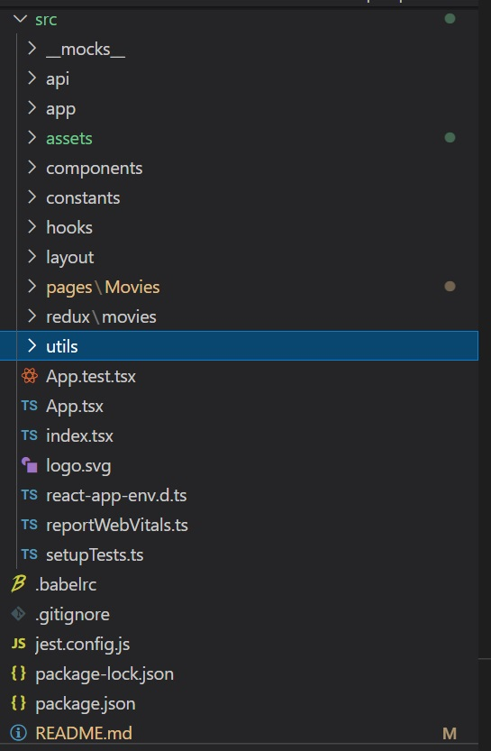
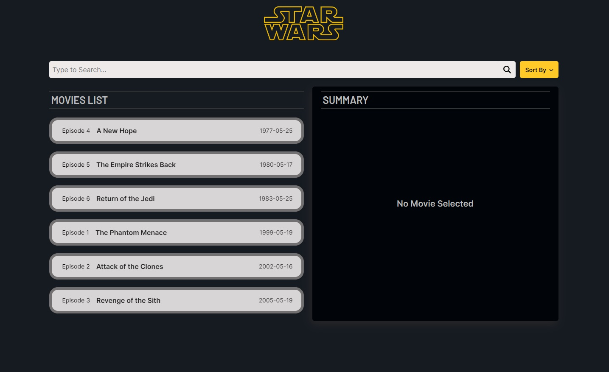
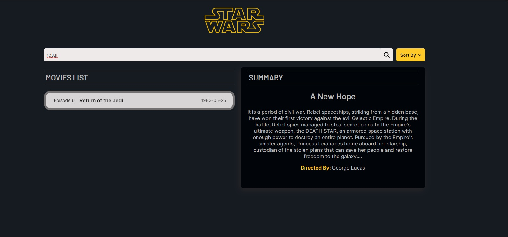
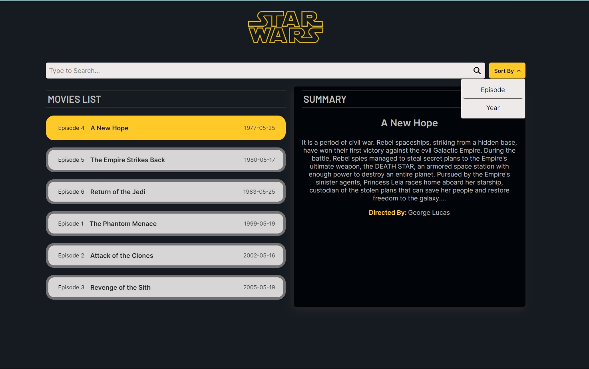
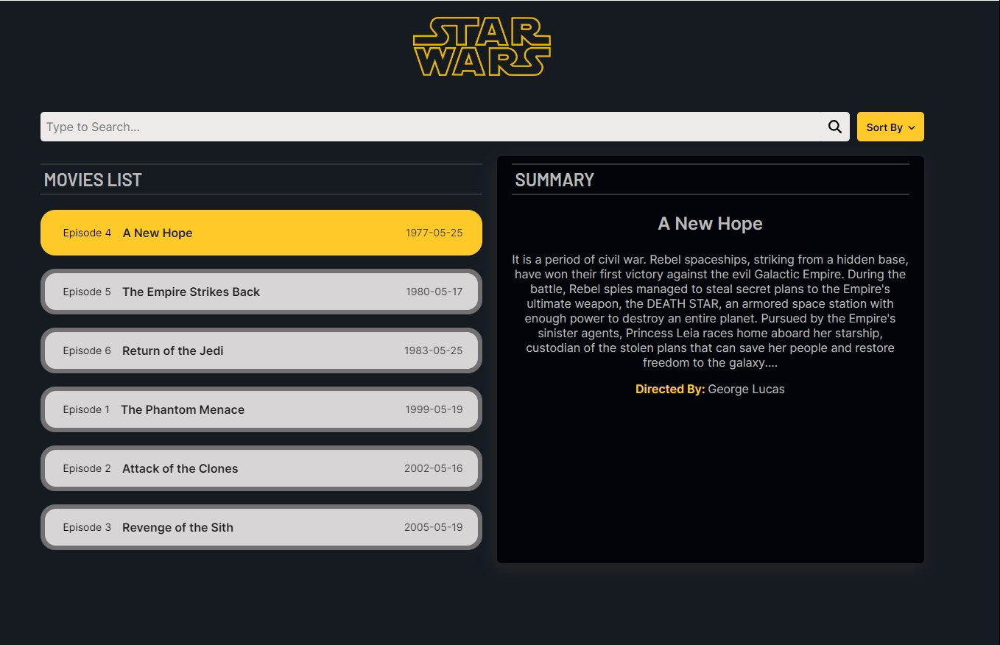
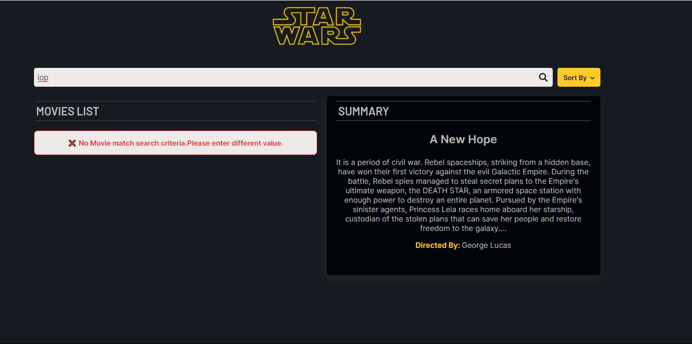
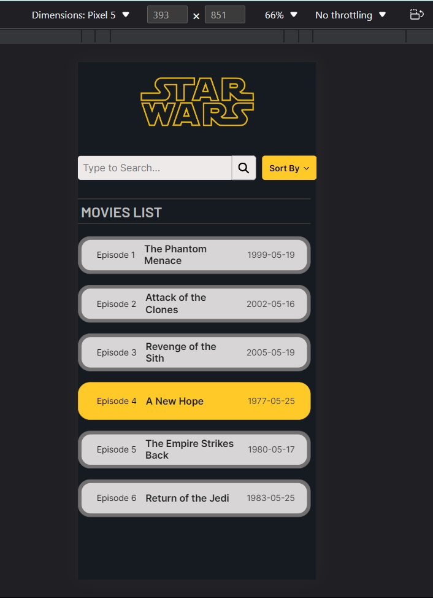
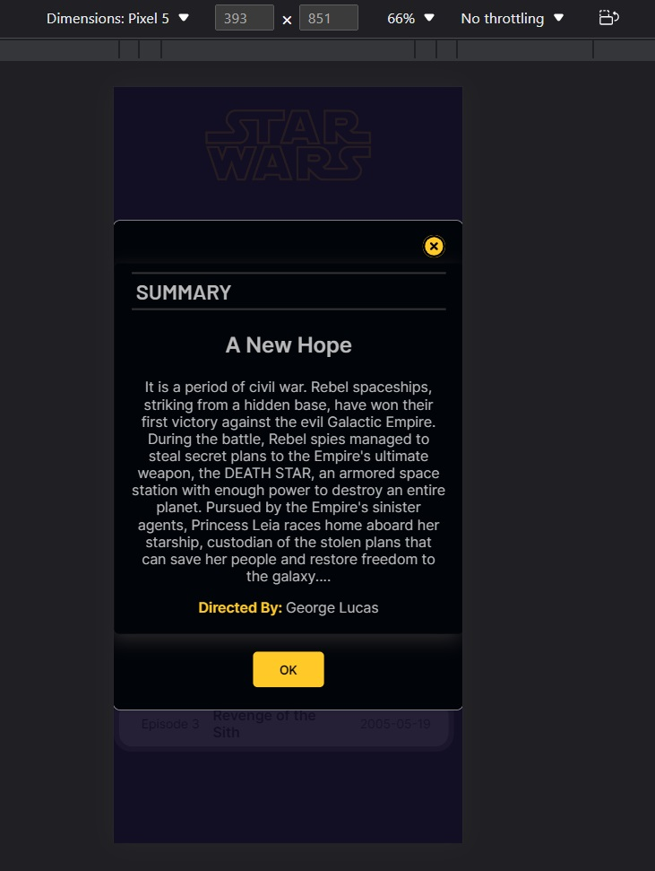
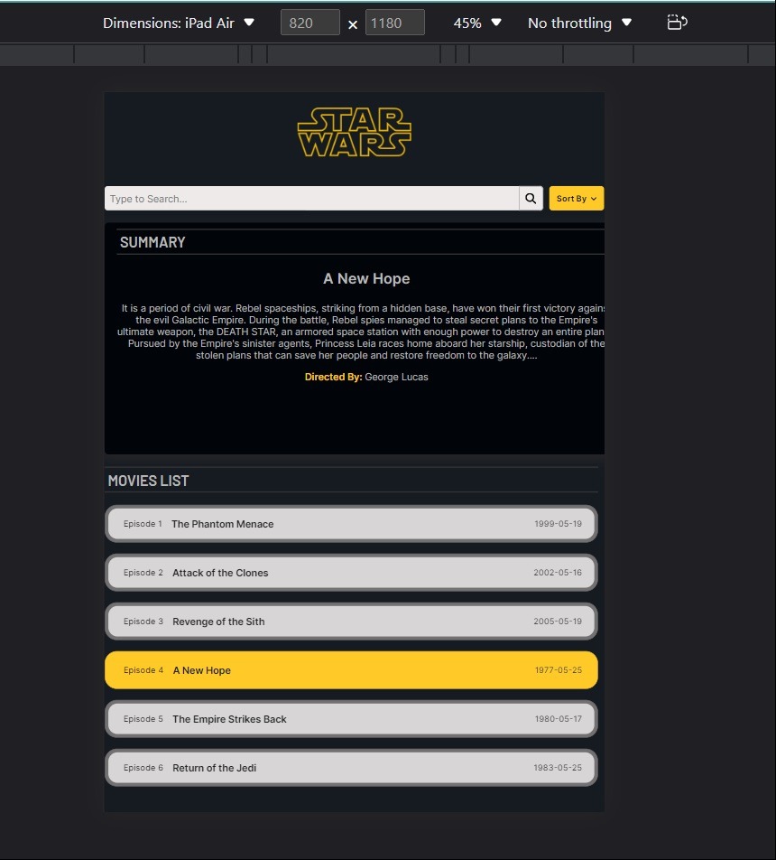

# Simple Implementation of STAR WARS Movie App

Responsive single page application oriented to display the list of STARWARS movies and display its synopsis on selection, designed in accordance to UX principles.

As it is a STARWARS related application, the theme was chosen to be Dark with some fluroscent touch.

## Table of Contents

- [Technologies used](#technologies-used)
- [API Used](#api-used)
- [Testing](#testing)
- [Project Structure](#project-structure)
- [Available Scripts](#available-scripts)
- [Functionality](#functionality)
- [Assumptions](#assumptions)
- [Todo](#todo)

## Technologies used

- [React](https://reactjs.org/) single page application - 18.2.0.
- [Redux Tool Kit](https://redux-toolkit.js.org/) - 1.8.6
- [Typescript](https://www.typescriptlang.org/) - 4.8.4
- [axios](https://www.npmjs.com/package/axios) - 1.1.2
- [classnames](https://www.npmjs.com/package/classnames) - 2.3.2

## API used

- [swapAPI](https://swapi.dev/) The star wars API.

## Testing

The testing strategy for this project is based on the following two libraries:

* [react-testing-library](https://github.com/kentcdodds/react-testing-library): these are some testing utilities that allow you to write tests that work with actual DOM nodes. You can think of it as a replacement of the popular [Enzyme](https://github.com/airbnb/enzyme) testing library.
* [Jest](https://jestjs.io/): test runner developed by Facebook, it ships with `create-react-app`. It is also used to mock some of the modules that are required on the tests.
* [axios-mock-adapter](https://www.npmjs.com/package/axios-mock-adapter) Axios adapter that allows to easily mock requests
 
## Project Structure

The project is structured keeping in mind of scalability and reusability. Project mainly consists of two folders.
 - public : which contains the index.html file and one icon for the tab.
 - src: contains the main business logic codes and the structure is as shown below.
  - mocks : contain the files needed for jest library for mocking css.
  - app: the main store.js file and hooks.js wrapper file is kept here.
  - api: folder for keeping all the reusable service function along the api interceptors and apiClients.
  - assets: folder for keeping all common assets like icons, logos, screenshots as well as the global css file to keep the code structure cleaner.
  - components:all common re-usable components are kept here. Mostly data and handler driver components are kept here. Atomic pattern is followed for each component.
  - constants: folder consisits of the constants needed for utilities and data driven components.
  - hooks: folder consisits of reusable custom hooks for the application.
  - layout: folder to keep layout components like Headers, Footers, Navigation etc.
  - pages: folder consisits all the different page component, here we have only Home Page. We can keep signup page, login page etc here.
  - redux: folder consisits Slices and thunks of different features, separated in folders.
  - utils: folder consits of utility functions for 

Other root files like App.js, index.js are kept inside the src folder.

## Available Scripts

In the project directory, you can run:

### `npm install`

To install all the dependencies.This should be the first step post cloning the repository.

### `npm start`

Runs the app in the development mode.\
Open [http://localhost:3000](http://localhost:3000) to view it in the browser.

The page will reload if you make edits.

### `npm run test`

Triggers the complete test suite of the application created using react-testing-library. Jest command is used in the script.

### `npm run build`

Builds the app for production to the `build` folder.\
It correctly bundles React in production mode and optimizes the build for the best performance.

The build is minified and the filenames include the hashes.\
App is ready to be deployed!

## Functionality

 On landing on the application page, the application loads the list of star war movies from the API. A spinner will be visible depending on the latency of the API.

 

The main functional component of the application consists of below sections.

- Header : component consist of the clickable STAR WAR logo which opens the starwars official website on a new tab on clicking. The Logo is highlighted on hover.
- Control bar : below the header card is the control bar, which decides how and what we see in the movie list. It contains two components , the seach bar and the sort button.

    - Search Bar : dynamic component which takes debounced values and filters the movie list based on the matching substrings. The lens icon is for cosmetic value as the search takes place on change of the input value in the search box.

    

    - Sort Button : dynamic data driven component,which can be scalable to contain any number of sort options. The Button opens up the options on hover, rather than a click, so as to reduce the number of clicks and improve the User Experience. All sort options are highlighted on hover, can be selected on click and selected sort option is specifically highlighted.

    

- Movies List Area : Shows the available list of movies for selection. The selected Movie is highlighted and all the options on hover are brightened.
Each movie bar contains details of the episode number, title and date of release.
The movies in list and order in which they are displayed are handled by the control bar. When no movies are available post search, a prompt is displayed.

  

  When no movies are available post search, a prompt is displayed.

  

- Summary Card : Presented on the side of Movies List for users with screen width more than 885px, on top of movie list are for users with screen width between 885px and 550px and as a closeable Modal for users with screen width less than 550px. By default the Summary card is empty when there is no selection, and a prompt stating no movies are selected is displayed.

The page is designed taking into consideration of responsiveness. The application is compatible both in mobile as well as tab screens.

### Mobile Screen

The Summary is displayed as a popup/modal, to have a better UX for mobile users.

### IPad Screen

## Assumptions

- There are no more pages for this application, hence React Router is not implemented.

## TODO

- Add animation/transition effects for all the trasitions.
